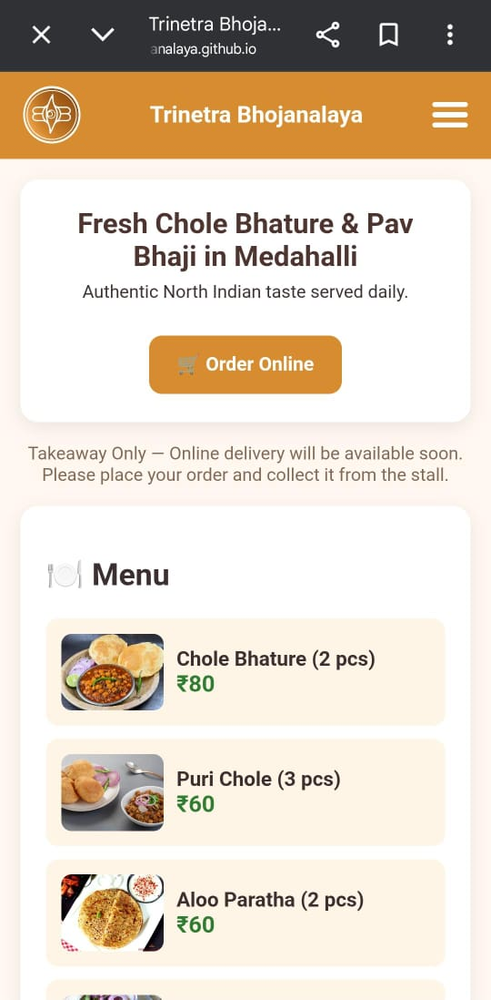
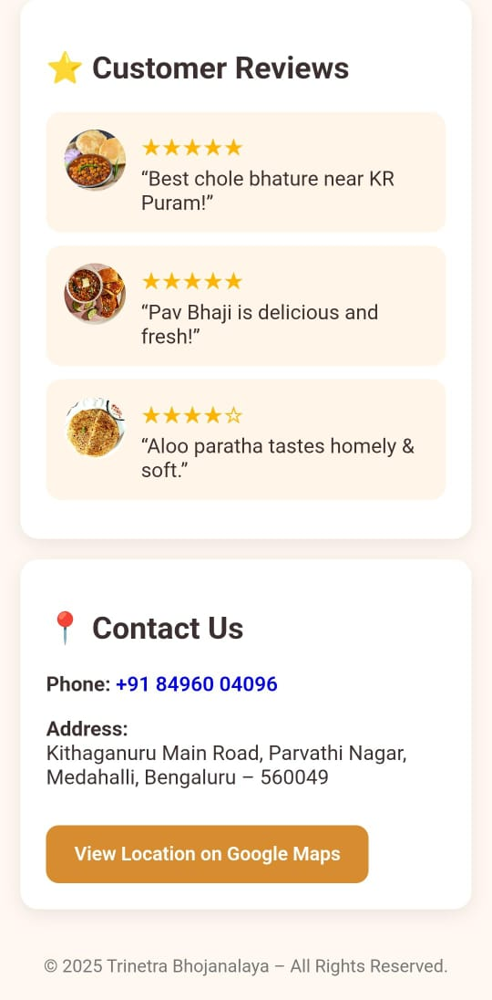
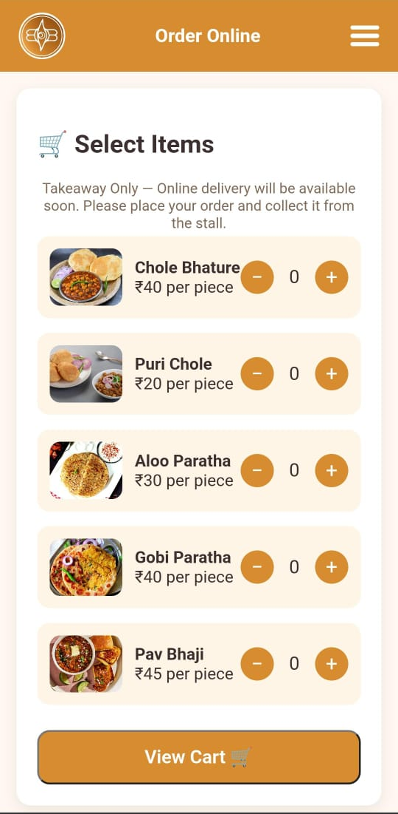
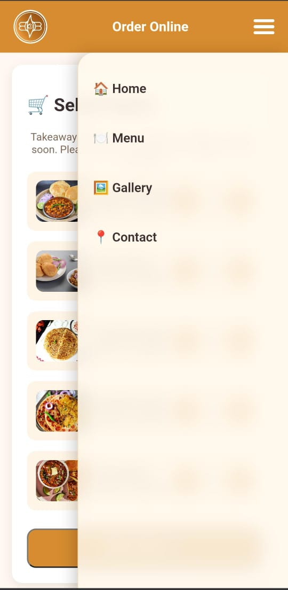

Trinetra Bhojanalaya – Business Website

🔗 Live Website:
https://trinetra-bhojanalaya.github.io/

## 📌 Overview
Developed a fully responsive business website for a food stall to showcase menu items, contact details, branding, and WhatsApp-based ordering.

The project focuses on clean UI design, structured layout, and real-world deployment using GitHub Pages.

---

## 🛠 Tech Stack
- HTML5  
- CSS3  
- JavaScript  

---

## 🚀 Features
- Responsive layout (mobile-first design)
- Smooth navigation system
- WhatsApp integration for direct orders
- Structured and optimized codebase
- Clean and minimal UI

---

## 👨‍💻 My Role
- Designed the user interface  
- Developed front-end functionality  
- Integrated WhatsApp order system  
- Deployed the website using GitHub Pages  
- Managed version control with Git  

---

## 📈 What I Learned
- Structuring production-ready HTML/CSS  
- Deployment workflow using GitHub Pages  
- Real-world client requirement handling  
- Improving UI responsiveness  

## 📸 Screenshots

### Homepage

### Menu Section

### Cart Page

### Navigation Slider

